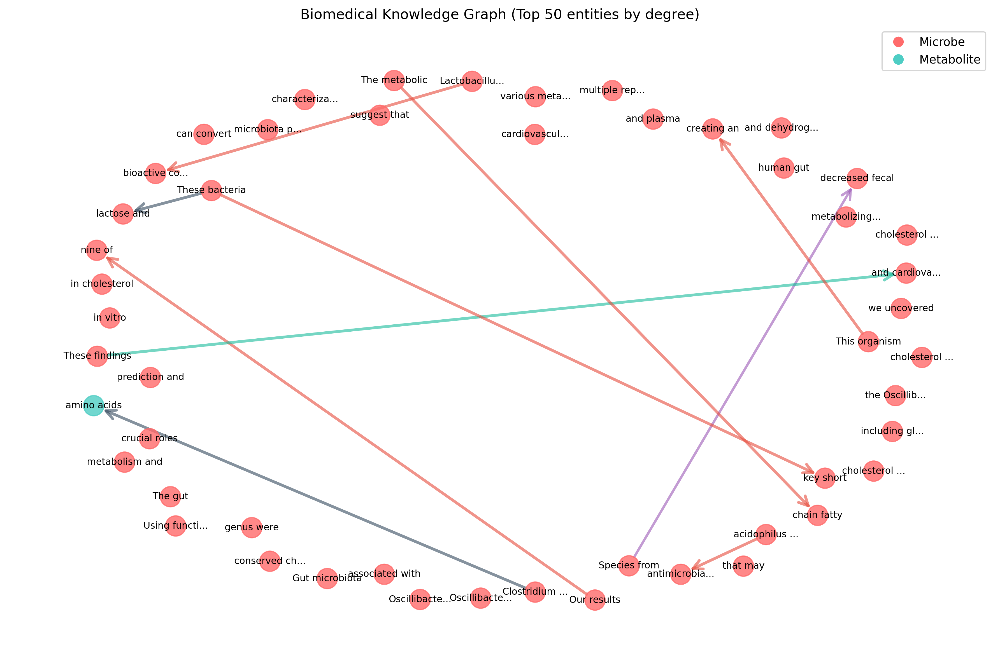

# bio-relation-demo
> 面向微生物-代谢物关系抽取与知识图谱构建的综合演示仓库

本仓库展示了一个端到端的演示流程：从 **文献采集 → 文本分类 → 实体关系抽取 → 知识图谱构建 → 可视化与评测**。  
所有 Demo 均可离线运行，无需 API 密钥。

---

## 📂 仓库结构

```
bio-relation-demo/
├── demo/                # 离线知识图谱构建 Demo
│   ├── scripts/         # 主运行脚本
│   ├── src/             # 抽取/构建/评测/可视化模块
│   ├── data/            # 演示输入与金标准
│   └── results/         # 输出结果
├── docs/
│   ├── prd.md                   # 系统 PRD 与整体规划
│   └── crawler_performance.md   # 爬虫性能报告
├── reports/
│   ├── training_report.txt      # 文献分类器训练报告
│   └── classification_report.txt# 百万级文献分类结果汇总
└── README.md
```

---

## 🚀 快速开始

### 1. 环境准备
```bash
cd demo
pip install -r requirements.txt
```

### 2. 运行 Demo
```bash
python scripts/demo_run.py
```

### 3. 查看结果
输出文件位于 `demo/results/`：
- `extraction_results.jsonl`：实体关系抽取结果  
- `knowledge_graph.json`：知识图谱数据  
- `kg_report.html`：可视化报告  
- 各类 PNG 图表（网络图、统计图、邻接矩阵等）

---

## 📊 主要成果

- **数据采集**  
  - PubMed 爬虫优化：抓取速度提升约 **5 倍**，HTTP 错误率降低 **99%**。  

- **文本分类**  
  - Logistic 分类器（12 特征）：  
    - 测试集准确率 **96.7%**  
    - F1 分数 **0.968**  
    - 精确率 **0.938**  
    - 召回率 **1.000**  
    - ROC AUC **0.982**  
    - 过拟合程度低（约 0.035），推荐生产使用。  
  - 大规模应用：在 **1,118,882** 篇文献中筛选：  
    - 接受文章 **309,218 (27.6%)**  
    - 拒绝文章 **612,579 (54.7%)**  
    - 不确定文章 **197,085 (17.6%)**  
    - 平均置信度 **0.729**  

- **知识图谱构建**  
  - 离线 Demo（5 篇样例文献 → **200+ 实体 & 10+ 关系**）。  
  - 支持自动评测、关系一致性检查与可视化输出（JSON/HTML/PNG）。  

---

## 🧪 Demo 输出示例

**1. 三元组 JSONL（片段）**
```json
{"relations": [{"head": "lactobacillus reuteri", "rel": "produces", "tail": "reuterin"}]}
{"relations": [{"head": "butyrate", "rel": "inhibits", "tail": "e. coli"}]}
{"relations": [{"head": "bifidobacterium longum", "rel": "produces", "tail": "acetate"}]}
```

**2. 评测指标**
```
precision=0.85
recall=0.78
f1=0.81
latency_sec=1.23
```

**3. 可视化网络图**


---

## 🎯 项目定位

- 🎓 **学术研究**：系统化整理微生物-代谢物交互  
- 💼 **工程能力**：展示端到端 NLP + KG 流程的实现  
- 🔍 **扩展方向**：Neo4j 图数据库、RAG 检索增强、下游问答系统  

---

## 🧭 目录导航

- `demo/`：离线可运行的最小演示（抽取 → KG → 评测 → 可视化）  
- `docs/prd.md`：需求、架构与分阶段交付规划  
- `docs/crawler_performance.md`：爬虫性能与稳定性优化  
- `reports/training_report.txt`：分类器训练与指标  
- `reports/classification_report.txt`：大规模分类结果汇总

